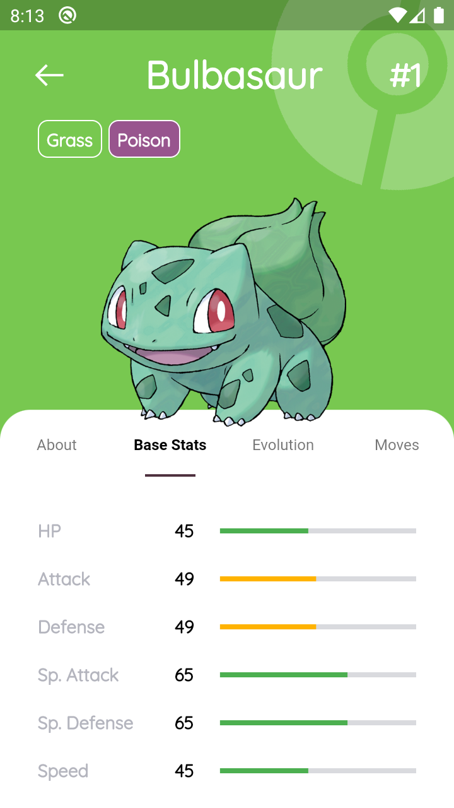

# PokeDex App  

A **Pokémon fan application** built with **Flutter**, powered by the [PokéAPI](https://pokeapi.co/).  
This project demonstrates how to consume REST APIs in Flutter while showcasing clean UI and structured data management.  

---

## ✨ Features  
- 📖 **Pokédex** – Browse and explore detailed Pokémon information  
- 🌀 **Types** – View Pokémon types with strengths and weaknesses  
- 🎒 **Items** – Discover Pokémon items and their effects  
- ⚔️ **Moves** – Explore Pokémon moves with stats and descriptions  
- 💡 **Abilities** – Learn about unique Pokémon abilities  
- 🌍 **Regions** – Navigate through Pokémon regions  

---

## 🛠️ Tech Stack  
- **Flutter** – Cross-platform app development  
- **Dart** – Programming language for Flutter  
- **PokéAPI** – Open-source Pokémon RESTful API  

---

## 📸 Screenshots  

<div align="center">  
    
  <br>  
    
    
</div>  

---

## 🚀 Getting Started  

### Prerequisites  
- [Flutter SDK](https://flutter.dev/docs/get-started/install) installed  
- A code editor (VS Code / Android Studio recommended)  

### Installation  
```bash
# Clone the repository
git clone https://github.com/SurajLad/PokeDex-App.git

# Navigate into the project
cd PokeDex-App

# Install dependencies
flutter pub get

# Run the app
flutter run

```

---

## 🙌 Credits

- [Saepul Nahwane](https://dribbble.com/shots/6563578-Pokedex-App-Animation) - UI Inspired from here.
- FlatIcons & FreePik - For graphics

---
